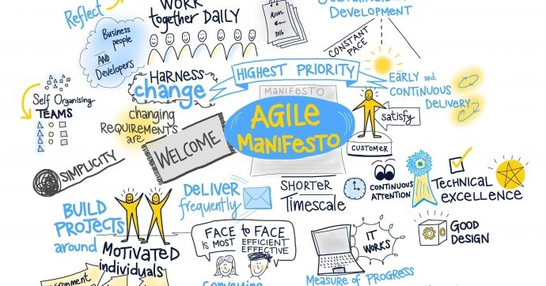

Vous voulez vous engueuler en réunion ou autour de la machine à café (qui n'aime pas une bonne foire d'empoigne improductive où chacun repart convaincu d'avoir raison) ?

J'ai une recette qui marche à tout les coups : 

D'un air ingénu lancez cette question en l'air : 

 > "C'est quoi être Agile pour vous ?"

Préparez le pop-corn :)

Si vous voulez que ce soit encore plus spectaculaire assurez-vous d'avoir cette discussion avec des gens au métier bien différent: mélangez des dev avec des commerciaux ou votre service marketing. Résultats garantis.

En quelques années, l'agilité est passé du statut de concept obscur évoqué par quelques initiés à celui de buzzword. Comme tout les buzzwords tout le monde s'empresse de l'utiliser à toutes les sauces ou au contraire de le démolir par pur esprit de contradiction, tout en survolant copieusement le sujet.

**Résultat :** 

On entend tout et surtout n'importe quoi sur l'agilité, et en tant qu'agiliste convaincu on se retrouve régulièrement confronté à une multitude d'idées reçues, de perceptions erronées et de fantasmes. 

On s'empresse donc de brandir notre bâton de pélerin et on s'applique à démontrer à tous qu'ils ont tort: 

> L'agilité/Agile ce n'est pas ça *(bordel)*. 
> 
> Vous n'avez rien compris *(bande de nazes)*.
>

Force est alors de constater que ce n'est pas si simple d' expliquer simplement ce que l'on entend par Agile, agilité, méthodes Agile, être agile, faire de l'Agile... 

Au mieux on parvient à convaincre ceux qui étaient déjà convaincus, dans la plupart des cas on ne fait que rajouter à la confusion ambiante et dans les pires on passe pour un gros relou, voire un intégriste...

 <!--more-->

# Agilité, Agile et méthodes Agile

Alors, c'est quoi l'agilité ? 

>
>L'agilité est la capacité à répondre au changement. Est agile une organisation ou une équipe qui est capable de s'adapter avec
> flexibilité et réactivité à un monde complexe et changeant.
> 

Voilà c'est tout. **L' agilité c'est ça, point.**

Si il est si simple de définir l'agilité alors pourquoi on s'engueule autant et pourquoi avons nous tant de mal à l'expliquer ?

Le problème principal auquel on est confronté lorsque l'on tente d'expliquer l'agilité est que souvent on mélange tout : agilité, Agile, méthodes Agile, être agile, faire de l'Agile...

La deuxième raison est que si on peut s'accorder sur une définition simple, généralement on est pas d'accord sur la façon d'arriver à rendre nos équipes et nos organisations agiles.

## agilité != Agile

Agile (avec un grand A) n'est pas un état. Agile est un ensemble de valeurs et de principes qui ont été formalisées en 2001 dans le [manifeste Agile](http://agilemanifesto.org/).

## C'est quoi le manifeste Agile ?

Agile est un mouvement né d'un constat: les méthodes traditionnelles de gestion de projet (Cycle en V, Waterfall) appliquées au développement logiciel ne fonctionnent pas. Elles ne permettent pas l'adaptabilité nécessaire à des projets complexes, elles conduisent trop souvent à l'échec et ne maximisent pas la valeur produite.

Le 13 novembre 2011, dix sept leaders et experts du développement logiciel qui partageaint ces constats se sont réunis dans une station de ski de l'Utah. Tous avaient expérimentés de nouvelles méthodologie et toutes reposaient une approche itérative, collaborative et pragmatique du développement logiciel avec un objectif : maximiser la valeur pour le client.

Entre deux descentes de pistes ils ont formalisé leurs idées dans un manifeste: l'[Agile Manifesto](agilemanifesto.org).
*(Pour ceux qui ont cliqué sur le lien: oui le site est terriblement moche.)*

Le manifeste Agile repose sur quatre valeurs:

- Les individus et leurs interactions plus que les processus et les outils
- Des logiciels opérationnels plus qu’une documentation exhaustive
- La collaboration avec les clients plus que la négociation contractuelle
- L’adaptation au changement plus que le suivi d’un plan

En plus des quatres valeurs il énonce douze principes:

> Notre plus haute priorité est de satisfaire le client
en livrant rapidement et régulièrement des fonctionnalités
à grande valeur ajoutée.

> Accueillez positivement les changements de besoins,
même tard dans le projet. Les processus Agiles
exploitent le changement pour donner un avantage
compétitif au client.

> Livrez fréquemment un logiciel opérationnel avec des
cycles de quelques semaines à quelques mois et une
préférence pour les plus courts.

> Les utilisateurs ou leurs représentants et les 
développeurs doivent travailler ensemble quotidiennement
tout au long du projet.

> Réalisez les projets avec des personnes motivées.
Fournissez-leur l’environnement et le soutien dont ils
ont besoin et faites-leur confiance pour atteindre les
objectifs fixés.

> La méthode la plus simple et la plus efficace pour 
transmettre de l’information à l'équipe de développement
et à l’intérieur de celle-ci est le dialogue en face à face.

> Un logiciel opérationnel est la principale mesure d’avancement.

> Les processus Agiles encouragent un rythme de développement 
soutenable. Ensemble, les commanditaires, les développeurs
et les utilisateurs devraient être capables de maintenir
indéfiniment un rythme constant.

> Une attention continue à l'excellence technique et
à une bonne conception renforce l’Agilité.

> La simplicité – c’est-à-dire l’art de minimiser la 
quantité de travail inutile – est essentielle.

> Les meilleures architectures, spécifications et 
conceptions émergent d'équipes autoorganisées.

> À intervalles réguliers, l'équipe réfléchit aux moyens
de devenir plus efficace, puis règle et modifie son
comportement en conséquence.

**Quand on parle d'Agile c'est à ces valeurs et à ces principes que l'on se réfère.**

Lorqu'une équipe se définit comme Agile c'est quelle applique (ou tente d'appliquer) ces principes: elle privilégie les interactions humaines en face à face (y compris avec le client), elle accepte les changements et travaille de manière itérative. Elle cherche à créer une équipe auto-organisée et responsable. Elle cherche en permanence à s'améliorer pour maximiser la valeur et la qualité produite.

Agile est un mouvement, un paradigme, une approche. Certains vont jusqu'à parler de culture Agile.  
Les équipes Agile appliquent généralement une méthodologie, elles sont nombreuses mais repose toutes sur ces mêmes fondamentaux formalisés dans le manifeste Agile. 

## Méthodologies Agile

Les méthodes agiles sont nombreuses, on peut notamment citer:

- Scrum

- Xtreme Programming (ou XP)

- Crystal Clear

- Behavior Driven Development (BDD)

- Features Drivent Development (FDD)

**Scrum est de loin la plus utilisée et est donc souvent confondu avec Agile.** 

### Scrum != Agile

Scrum est un framework Agile qui définit un cadre pour organiser le développement d'un produit (généralement logiciel).
Scrum repose sur les principes Agile, ses deux créateurs Jeff Sutherland et Ken Schwaber font d'ailleurs partis des auteurs du manifeste.

**Pour autant Agile ne se limite pas à Scrum**: de nombreuse équipes et organisations travaillent selon les principes Agile sans utiliser Scrum.  
On peut donc faire de l'Agile sans parler de sprint, de Product Owner, de scrum masters, de daily stand-ups, etc... 

On peut également être Agile sans faire de Poker planning, rédiger des Users Stories... Mais ce sont des bonnes pratiques (issues d'Xtreme Programming) que la plupart des équipes Agile utilisent car elles ont fait leur preuves. Bien implémentées, ces pratiques renforcent l'agilité de l'équipe.

Les critiques les plus virulentes envers l'agilité sont souvent, quand on y regarde de plus près, des critiques envers une méthode Agile. Le plus souvent c'est Scrum qui est la cible (la rançon de la gloire) mais pas Agile en tant que tel.  

# Idées reçues, mythes et fantasmes

Généralement quand on parle d' agilité ou d' Agile au bureau (ou au pub, mais c'est un peu chiant comme conversation de pub) on est confronté à des idées reçues bien grasses. Sans crier à la FAKE NEWS, je vais tenter de répondre à quelques uns de ces mythes autour d' Agile. 

## Agile c'est le dernier truc à la mode

Celle là je l'entends souvent.  
Et pourtant c'est tout le contraire, le manifeste Agile date de 2001. La même année où Windows XP est sorti, et le premier Ipod !
Donc comme dernier truc shiny on a vu mieux. 

Scrum date de 1996, XP de 1999. Les méthodes Agile sont utilisées depuis 20 ans, et ces méthodes ont fait leur preuve.
Désolé pour les early adopters, mais l'agilité c'est déjà un truc de vieux :)

## Agile c'est coller des post-its

Si il y a un outil emblématique des équipes Agile c'est bien le bloc de post-it!
Ils sont versatiles et sont un moyen simple d'organiser des idées et de les rendre visibles, donc les équipes Agile en font souvent un usage immodéré. 
Mais ce n'est que la partie emergée de l'iceberg, les post-its ne sont qu'un outil et ne sont pas obligatoires :)

## Agile c'est très simple à mettre en place

Malheureusement, non pas toujours. Atteindre l'agilité est souvent un long chemin bourrée d'embûches. 
Chaque équipe et organisation est différente, le contexte et la culture auront un énorme impact sur la facilité ou non à mettre en place de nouvelles méthodes.  
Agile demande parfois d'opérer une véritable révolution culturelle et tout les experts en change managment vous diront que modifier les comportements et les pratiques ce n'est jamais simple!

## Les méthodologie Agile donnent des résultats immédiatement

Pas toujours :)  
Etre Agile est un voyage plus qu'une destination et chaque route est différente. 

Ma modeste expérience m'a montré que oui, les méthodes Agile peuvent donner des premiers résultats très vite.  
Une équipe qui ne prenait jamais le temps de faire le point pour s'améliorer pourra tirer des bénéfices immédiats de la pratique de la rétrospective par exemple. 

Mais attention: être Agile suppose de constamment se remettre en question et de ne pas mettre les problèmes sous le tapis. Pour une équipe qui vient de commencer son voyage vers l'agilité cela peut être violent : on a le sentiment que l'on a identifié beaucoup de problèmes mais peu de solutions ...

Agile n'est pas une baguette magique !

## Pour être Agile il suffit de lire quelques livres sur le sujet

Agile repose sur des principes simples, le guide Scrum ne fait que quelques pages: la théorie de base peut effectivement être assimilée très rapidement.
Mais Agile est avant tout une pratique, une façon d'être et de réagir face aux changements.  
C'est en forgeant qu'on devient forgeron, et c'est bien en pratiquant Agile que l'on renforce son agilité.

Et une fois que l'on pratique on se rend vite compte que la théorie n'est pas si simple que ça ! D'où la littérature impressionnante sur les pratiques Agile.

## Agile c'est la réunionite aigüe: ils passent leur temps en réunion

Si on vous balance ça vous pouvez mettre un billet sur le fait que une implémentation de Scrum a méchamment foiré dans la boite :)

Scrum préconise quatre cérémonies: le daily stand-up, la sprint-review, le sprint planning et la rétrospective.  
Alors si le daily dérappe systématiquement et dure une heure, que le sprint planning prend la journée et que le scrum master a oublié qu'il avait une montre, oui une équipe Scrum peut passer sa vie en réunion...

Mais c'est oublier que Scrum impose de timeboxer toutes ces cérémonies et de respecter scrupuleusement les horaires. La daily ne doit pas durer plus de 15 minutes, point barre. 

## Agile ce n'est que pour le développement logiciel

Effectivemnt à l'origine Agile a été formalisé par des équipes de développement logiciel. Et oui la plupart des équipes Agile se trouvent dans le secteur. 
Mais Agile a 20 ans, ses principes sont appliqués bien au delà du dev et du monde informatique, et on peut maintenant trouver de nombreux retours d'expérience sur l'application de méthodes Agile à de nombreux secteurs parfois très éloignés du web...

Il n'en reste pas moins que l'essentiel de la littérature Agile est à destination de l'industrie logicielle, mais cela est de moins en moins vrai. De nombreux métiers sont soumis aux mêmes contraintes: un marché qui évolue vite, des besoins utilisateurs changeants et une concurrence qui nécessite un time to market toujours plus rapide.  
Les méthodes LEAN, issues du monde industriel, sont d'ailleurs très proches d'Agile, à tel point que certaines méthodes telle que Kanban ou Lean Start-up sont appliquées par des équipes de développement logiciel dans un contexte Agile.

## Les équipes Agile sont plus rapides

Agile ne se focalise pas sur la rapidité: il ne s'agit pas de livrer le plus grand nombre de fonctionnalité le plus rapidement possible.

Les équipes Agile cherchent à maximiser la valeur tout en ne transigeant pas sur la qualité (la notion de craftmanship/savoir-faire est au centre de nombreuses pratiques).

Plutôt que de livrer vite beaucoup de fonctionnalités on préfère livrer peu de fonctionnalités mais plus souvent, avec un cycle d'itérations court. De cette manière on raccourcit la boucle de feedback et on évite de développer des fonctionnalités inutiles ou apportant peu de valeurs aux utilisateurs.

## Les équipes Agile ne font pas de planning

C'est l'un des mythes les plus courants sur Agile, et pourtant il est totalement faux.  
Les équipes Agile acceptent le changement, elles reconnaissent qu'il est inutile de concevoir un plan ultra détaillé sur 6 mois puisqu'il sera à jeter à la poubelle au bout de 3 semaines.

En conséquence le plan est constamment challengé et modifié en fonction de ce que l'équipe a appris lors de la précédente itération.

En réalité une équipe Agile est constamment en train de plannifier, mais elle refuse de suivre un plan pré-établi et statique.
La conséquence est que les équipes Agile sont plus prédictibles car leur plan et leurs estimations sont constamment mises à jour.

## Les équipes Agile ne rédigent aucune documentation

Cette idée reçue vient généralement d'une mauvaise lecture de la deuxième valeur du manifeste Agile : 

- Des logiciels opérationnels plus qu’une documentation exhaustive

Les équipes Agile reconnaissent la valeur de rédiger une documentation, mais elles privilégient la création de valeur.  
Une documentation qui ne sera jamais lue par personne n'apporte rien, donc inutile de perdre du temps à la rédiger.

Les échanges réguliers avec les clients et les utilisateurs sont au coeur des méthodes Agile, si une documentation est nécessaire elle sera rédigée et avec la satisfaction de produire quelque chose d'utile :)

